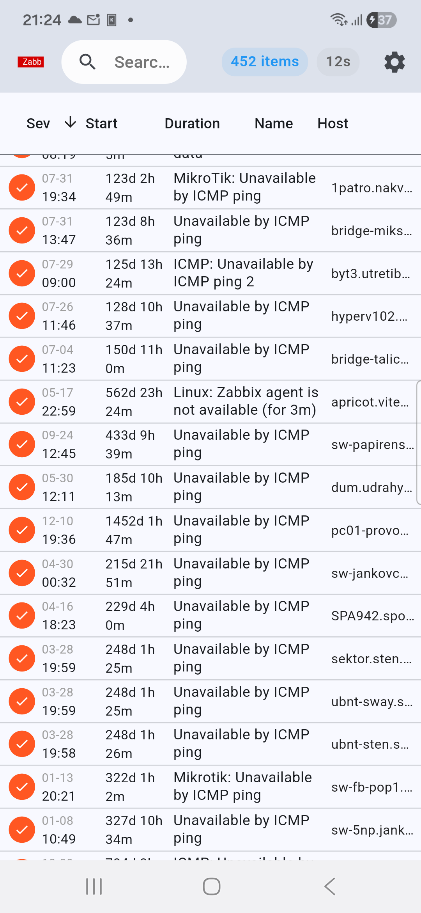
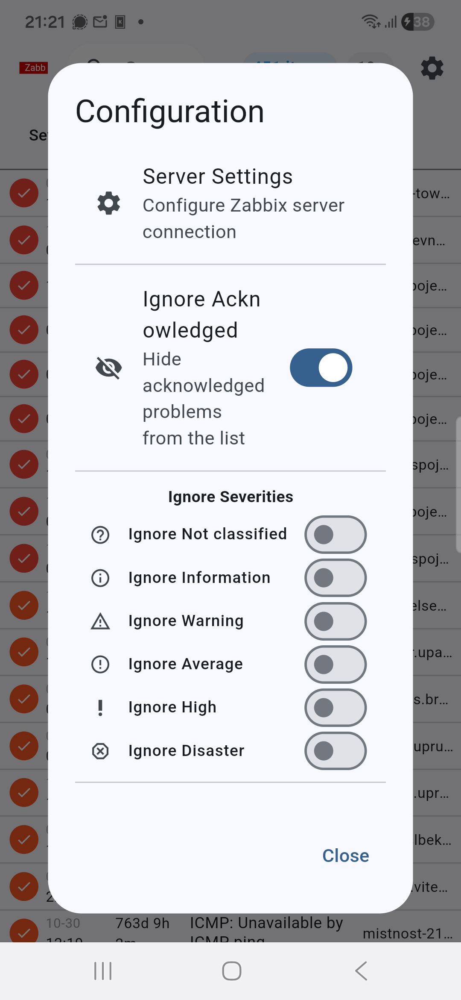
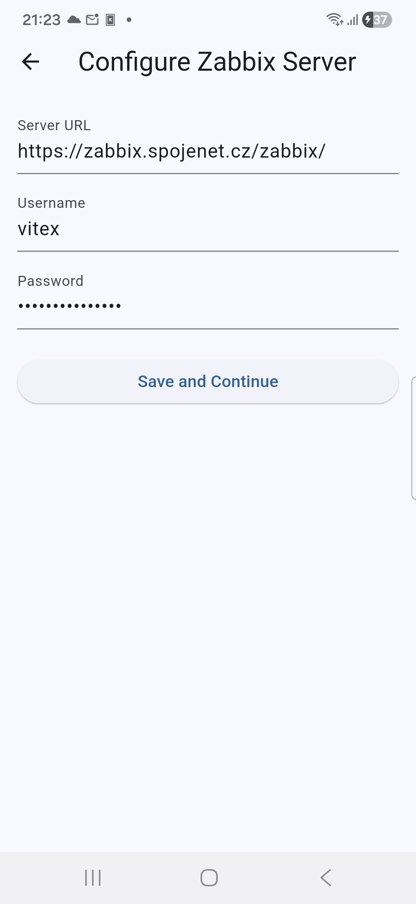
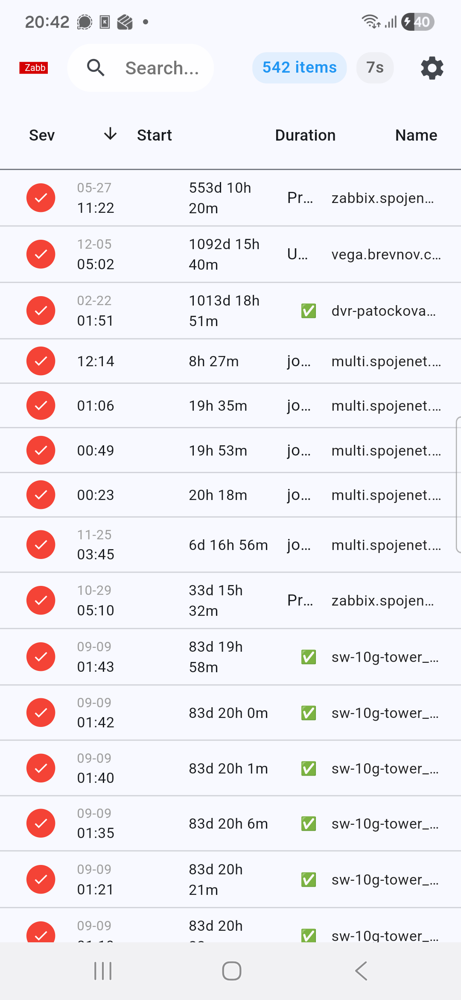

# Zabb - Flutter Mobile Client for Zabbix


Zabb is a Flutter-based mobile client for Zabbix monitoring system, enabling users to monitor and manage Zabbix resources from their mobile devices.

## Features

- 🔐 **Authentication** - Secure login with Zabbix server using saved credentials and auto-login
- 📊 **Problems Dashboard** - Real-time monitoring of Zabbix problems with auto-refresh
- 🔍 **Advanced Filtering** - Filter problems by severity level and hostname with persistent filters
- 🔔 **Smart Notifications** - Per-severity audio notifications with custom sound selection
- 📱 **Mobile-Optimized UI** - Ultra-compact, responsive design optimized for mobile devices
- ⚡ **Real-time Updates** - Auto-refresh every 30 seconds with countdown timer
- 🎵 **Audio Alerts** - Support for custom audio files and built-in notification sounds
- 🏷️ **Problem Management** - View detailed problem information, acknowledge and close problems
- 🖥️ **Host Mapping** - Proper hostname display instead of numeric IDs
- 📈 **Status Indicators** - Item counts, refresh timers, and visual status feedback
- 💾 **Persistent Settings** - User preferences and sorting maintained across sessions
- ⚙️ **Configuration Screen** - Comprehensive settings with ignore filters and notification setup

## Screenshots

### Problems Dashboard


### Configuration Dialog  


### Server Configuration


### Application Overview


The application features:
- **Login Screen** - With server configuration and auto-login capability
- **Problems Table** - Sortable columns with severity indicators, duration, and host information
- **Problem Details** - Comprehensive problem information with action buttons
- **Filtering System** - Interactive severity and hostname filtering with ignore options

## Getting Started

### Prerequisites

- Flutter SDK 3.2.0 or higher
- Dart 3.5.4 or higher
- A running Zabbix server with API access

### Installation

1. Ensure you have Flutter installed: <https://docs.flutter.dev/get-started/install>
2. Clone this repository:
   ```bash
   git clone https://github.com/VitexSoftware/Zabb.git
   cd Zabb
   ```
3. Install dependencies:
   ```bash
   flutter pub get
   ```
4. Run the application:
   ```bash
   flutter run
   ```

### Configuration

1. Launch the app and tap "Configure Server"
2. Enter your Zabbix server details:
   - Server URL (e.g., `https://your-zabbix-server.com`)
   - Username and Password
3. Save configuration and login

## Project Structure

```
lib/
├── main.dart                 # Application entry point and login screen
├── api/
│   └── zabbix_api.dart      # Zabbix API integration
├── screens/
│   ├── problems_screen.dart  # Main problems dashboard
│   ├── welcome_screen.dart   # Welcome and setup screen
│   └── configure_server_screen.dart  # Server configuration
└── services/
    └── auth_service.dart     # Authentication and data management
```

## Dependencies

- **flutter**: Mobile app framework
- **http**: API communication with Zabbix server
- **intl**: Date/time formatting
- **shared_preferences**: Local storage for configuration and user preferences
- **flutter_svg**: SVG asset support
- **audioplayers**: Audio notification system for alerts
- **file_picker**: Custom audio file selection from device storage

## Building for Release

### Android
```bash
flutter build apk --release
```

### Linux Desktop
```bash
flutter build linux --release
```

## API Compatibility

- Supports Zabbix API 6.0+
- Uses JSON-RPC 2.0 protocol
- Bearer token authentication

## Contributing

1. Fork the repository
2. Create your feature branch (`git checkout -b feature/amazing-feature`)
3. Commit your changes (`git commit -m 'Add some amazing feature'`)
4. Push to the branch (`git push origin feature/amazing-feature`)
5. Open a Pull Request

## License

This project is licensed under the MIT License - see the LICENSE file for details.

## Changelog

### v0.3.0 (2025-12-01)

- **NEW: Persistent Sorting** - Sort preferences maintained across problem view refreshes
- **NEW: Notification System** - Per-severity audio notifications with custom sound support
- **NEW: Configuration Screen** - Comprehensive settings with ignore filters and logout
- **NEW: Advanced Filtering** - Acknowledged problems filter and severity ignore switches
- Mobile layout optimization with ultra-compact design
- Enhanced search functionality with proper focus management
- Navigation flow improvements and UI cleanup
- File picker integration for custom notification sounds
- SharedPreferences integration for all user settings

### v0.1.0 (2025-12-01)

- Initial release
- Zabbix authentication with auto-login
- Problems dashboard with real-time updates
- Advanced filtering by severity and hostname
- Problem details and management (acknowledge/close)
- Mobile-optimized responsive design
- Auto-refresh with countdown timer

---

**Zabb** - Making Zabbix monitoring mobile and accessible.
